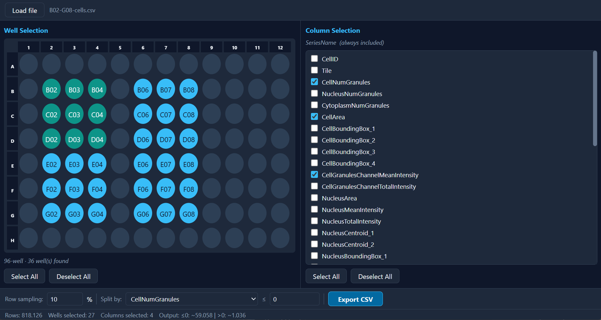

# CITableCleaner

A tool for filtering and exporting cell imaging measurement tables exported by CI Analyze 5+.

Load a CSV/Excel results file, select which wells and measurement columns to keep, and export a clean CSV — one file per selection. Column choices are remembered between sessions when the same file format is reloaded.

## Web app

**Live:** [https://cellular-imaging-amsterdam-umc.github.io/citablecleaner/](https://cellular-imaging-amsterdam-umc.github.io/citablecleaner/)

A browser-based version of CITableCleaner that runs entirely in the browser — no server, no installation — using [Pyodide](https://pyodide.org) to execute the same pandas-based data logic in a Web Worker.

### Features

- Accepts CSV/TSV and Excel (`.xlsx`) files; drag-and-drop or file picker.
- Displays a 96- or 384-well plate canvas; click wells to toggle selection.
- Column selection with per-format persistence via `localStorage`.
- Row sampling (export every N-th row, 1–100 %).
- Split export: export two CSVs split on a numeric column threshold (≤ / >).
- Status bar shows selected wells, columns, and estimated output row counts (including split counts and sampling estimates).
- A warning toast is shown when an `.xlsx` file larger than 50 MB is loaded, as parsing large Excel files with Pyodide is significantly slower than CSV.

> **Note:** On first load, Pyodide and pandas (~10 MB) are fetched from the CDN. Subsequent visits use the browser cache and load in under a second.



### Running locally

Because `worker.js` fetches `app.py` at runtime, the files must be served over HTTP — opening `index.html` directly as a `file://` URL will not work.

Any static file server works, for example:

```
# Python (from the web/ directory)
python -m http.server 8080

# Node.js
npx serve web/
```

Then open `http://localhost:8080` in Chrome or Edge (Firefox also supported).

### Deployment

The `web/` folder is self-contained and is automatically deployed to GitHub Pages via the included Actions workflow on every push to `main`. The live URL is [https://cellular-imaging-amsterdam-umc.github.io/citablecleaner/](https://cellular-imaging-amsterdam-umc.github.io/citablecleaner/). The folder can also be copied to any other static hosting service (Netlify, Azure Static Web Apps, etc.) without a build step.

### Web app files

| File | Purpose |
|---|---|
| `web/index.html` | HTML shell |
| `web/style.css` | Dark-slate / sky-blue theme |
| `web/app.js` | Main-thread JavaScript (UI wiring, downloads) |
| `web/plate.js` | Canvas `WellPlate` class (port of `plate_widget.py`) |
| `web/worker.js` | Web Worker — boots Pyodide, handles all Python calls |
| `web/app.py` | Pure Python data layer executed by Pyodide |

---

## Desktop app (PyQt6)

A standalone Windows desktop application for offline use or very large files.

### Download

Download the latest `CITableCleaner.zip` from the [Releases](../../releases) page, unzip, and run `CITableCleaner.exe`. No installation required.

### How it works

CITableCleaner is built around a three-step workflow:

1. **Load** — Open a CSV or Excel file exported by CI Analyze 5+. The file is parsed in a background thread so the UI stays responsive. The app auto-detects the plate format (e.g. 96-well, 384-well) from the well identifiers found in the data.

2. **Select** — The left panel shows an interactive well-plate grid. Click individual wells, or use *Select All* / *Deselect All* to choose which wells to include. The right panel lists every measurement column in the file; tick or untick columns the same way. Your column selections are saved per distinct set of column names and are restored automatically the next time you load a file with the same format.

3. **Export** — Choose an output folder and click *Export CSV*. One clean CSV is written for every selected well, containing only the chosen measurement columns. File names follow the pattern `<WellID>-cells.csv`.

A status bar at the bottom always shows the current row count, number of selected wells, and number of selected columns.

### Requirements

| Package | Minimum version | Purpose |
|---|---|---|
| Python | 3.10 | Runtime |
| PyQt6 | 6.6 | GUI framework |
| pandas | 2.0 | Table loading and filtering |
| openpyxl | 3.1 | Excel (`.xlsx`) file support |
| xlrd | 2.0 | Legacy Excel (`.xls`) file support |
| PyInstaller | 6.0 | Building standalone executables (dev only) |

Install all runtime + build dependencies at once:

```
pip install -r requirements.txt
```

### Run from source

```
pip install -r requirements.txt
python -m citablecleaner
```

### Build a standalone executable with PyInstaller

Two `.spec` files are provided. Run all commands from the repository root.

#### Quick-start / development build (recommended)

Produces a **folder** distribution (`dist/CITableCleaner/`). The app starts instantly because no extraction step is needed, and incremental rebuilds are fast.

```
pyinstaller citablecleaner-quickstart.spec
```

The executable is at `dist/CITableCleaner/CITableCleaner.exe`. It must stay inside the `dist/CITableCleaner/` folder (it depends on the sibling `_internal/` directory). To share the build, zip the whole `dist/CITableCleaner/` folder.

#### Single-file release build

Packs everything into one self-contained `.exe`. Startup is slightly slower because the files are extracted to a temp directory on first run.

```
pyinstaller citablecleaner.spec
```

The executable is at `dist/CITableCleaner.exe`.

#### Cleaning old build artefacts

Before doing a clean rebuild it is good practice to remove previous output:

```
Remove-Item -Recurse -Force build, dist   # PowerShell
# or
rmdir /s /q build dist                    # cmd
```
